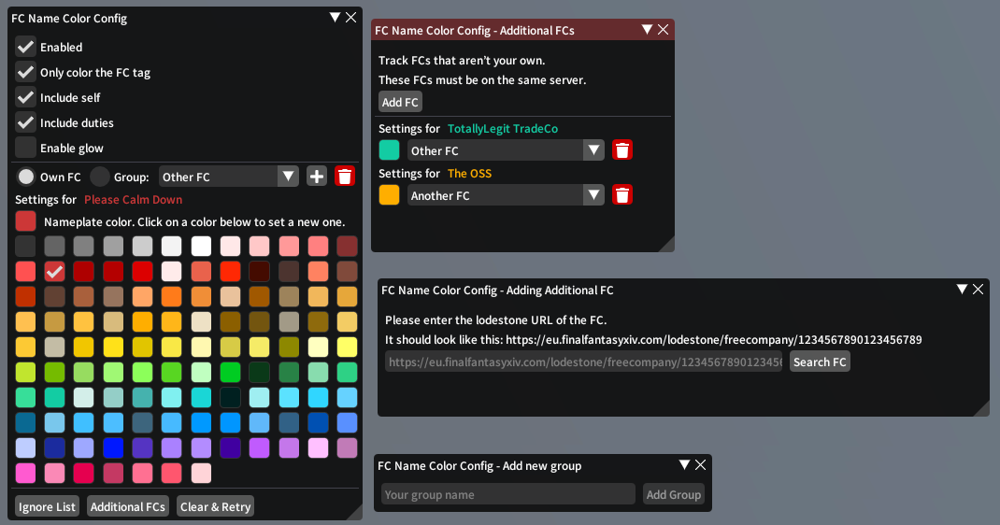
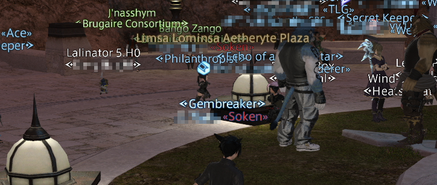

# FCNameColor

A plugin for [XIVLauncher](https://github.com/goatcorp/FFXIVQuickLauncher) that lets you colour character nameplates of your FC’s members.

## Usage

Type `/fcnc` to open up the configuration window.

From here you can tweak various settings:

## Known issues

- Matching players is done based on Lodestone data, since FC tags are not necessarily unique. Because of this there is not a 100% guarantee it will be accurate when players leave/join or change their names.
- Nameplates do not immediately update when changing colours or disabling/enabling the nameplate colouring options. This is a technical limitation of the method used to override the character nameplates, if someone finds a better way let me know!
- FCs that aren’t your own will not immediately be updated to account for rate limits on Lodestone. Additional FCs are updated on startup at a rate of once every 30 seconds or not at all if the last update was less than 2 hours ago.